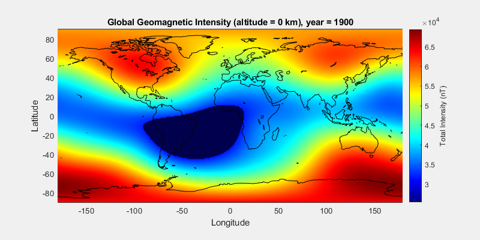

# SAA_IGRF

## 專案介紹
本專案使用 MATLAB 程式語言，利用 Aerospace Toolbox 的 igrfmagm 函數獲取 IGRF 全球地磁資料，繪製全球地表磁場隨時間之變化並標示出南大西洋異常區 （South Atlantic Anomaly, SAA）。

## 專案技術
MATLAB R2020b、igrfmagm in Aerospace Toolbox

## 資料夾說明
* data - IGRF資料放置處
* fig - 圖片放置處

## 實作
### 南大西洋異常區
南大西洋異常區 （South Atlantic Anomaly, SAA）是地球上磁較弱的區域，覆蓋範圍遍及南美洲南部及南大西洋海域，根據定義 SAA 的範圍為海平面地磁強度小於 32,000 nT 之區域。

### 國際地磁參考場
[國際地磁參考場 （International Geomagnetic Reference Field, IGRF）](https://wdc.kugi.kyoto-u.ac.jp/igrf/) 是用於描述地球磁場的標準數學模型，其廣泛用於地球深層內部、地殼、電離層和磁層的研究，模型本身由 [國際地磁及高空物理學會 （International Association of Geomagnetism and Aeronomy, IAGA）](https://www.iaga-aiga.org/) 開發和維護。本專案開發時 IAGA 所發佈之最新模型版本為 IGRF-13。  

### 獲取地表磁場資料
利用 Aerospace Toolbox 的 igrfmagm 函數，輸入所需要的高度、緯度、經度、年份及模型版本等參數，即可獲取由 IGRF 模型所算得的地磁資料。例如欲使用 IGRF-13 模型計算 2020 年的全球地表磁場可以輸入
``` MATLAB
altitude = 0;
lat = -90:1:90;
lon = -180:1:179;
year = 2020;
igrf_ver = 13;
B = igrfmagm(altitude, lat, lon, year, igrf_ver)
```
註：由於經度的 -180 與 180 對應的是同一條經度線，故只需要取其中一個即可，否則將會重複計算到同一點之資料。  
為了分析 SAA 隨時間之變化，需要獲不同時間的地磁數據，我們設定時間範圍為 1900 年至 2020 年，每 5 年一筆數據，並將數據依照年份 yyyy 命名其檔名為 B_total_yyyy.mat 儲存在 [data](./data) 路徑中。在 [IGRF_data.m](./IGRF_data.m) 中我們透過迴圈處裡簡化 IGRF 地磁資料的獲取過程。 

### 成果
透過 [plot_SAA_from_IGRF_data.m](./plot_SAA_from_IGRF_data.m) 即可得到 1900 年至 2020 年全球地表磁場隨時間變化之 GIF，其中 SAA 區域 （B_SAA < 32000 nT）以深藍色標示，圖中可以觀察到 SAA 在 1900 年至 2020 年間有逐漸擴張的趨勢。

